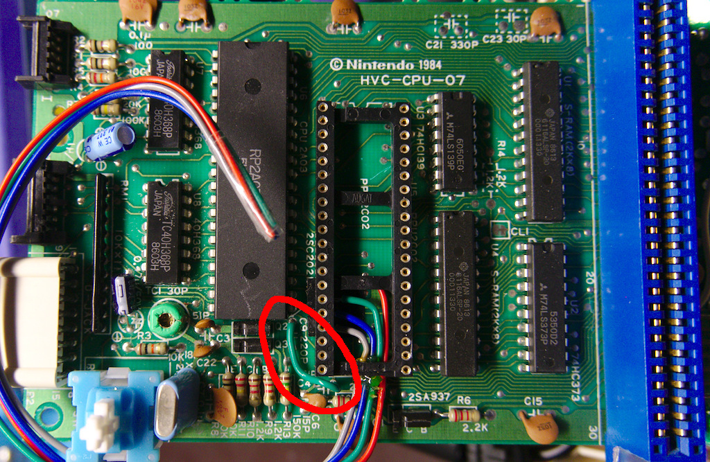
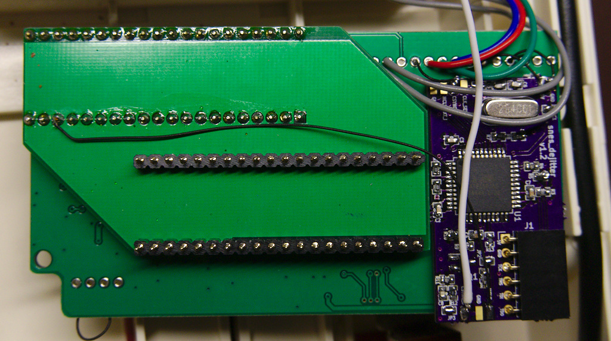

HVC-CPU-07 installation guide
==============

Steps

1. Desolder C4, C9 and XTAL from Famicom mainboard
2. Add a jumper wire between C4 & C9 pads on CPU/PPU sides as shown in the picture below (ignore wires outside of red highlight circle)
3. Short JP2 and JP3 on snes_dejitter board
4. Cover copper areas on the bottom of snes_dejitter with electrical tape
5. Attach snes_dejitter on the bottom of NESRGB adapter board via double-sided adhesive tape
6. Connect 5V, GND and CSYNC_i to respective pads on NESRGB board (CSYNC_i -> CS# with NESRGB jumper J8 open)
7. Connect MCLK_o as shown in the picture and CSYNC_o to AV connector (possibly via 470ohm series resistor depending on your cable and preference)

