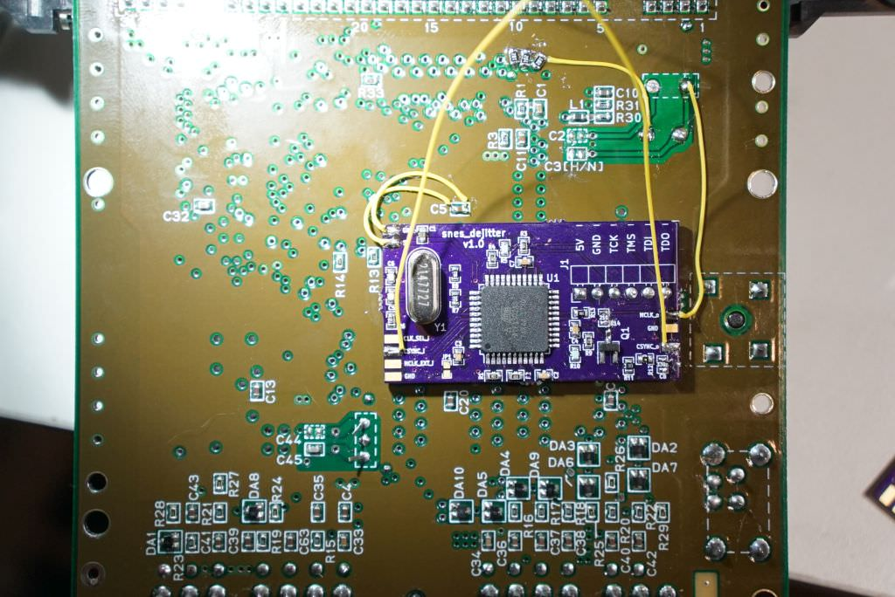

SNN-CPU-01 installation guide
==============

Features

* single MCLK provided by snes_dejitter
* de-jittered CSYNC on multi-AV pin 3 (compatible with RGB cables wired to use CSYNC)

Steps

1. Remove X1 and C3 from SNES mainboard
2. Leave JP2 open and close JP3 on snes_dejitter board (rev v1.0/v1.1: leave R14 unpopulated)
3. Cover copper areas on the bottom of snes_dejitter with electrical tape
4. Attach snes_dejitter on the bottom of SNES mainboard via double-sided adhesive tape
5. Connect 5V, GND and MCLK_o as shown in image below. CSYNC_i can be tapped from pin 7 of S-RGB, and CSYNC_o should be directly wired to pin 3 of multi-AV.

