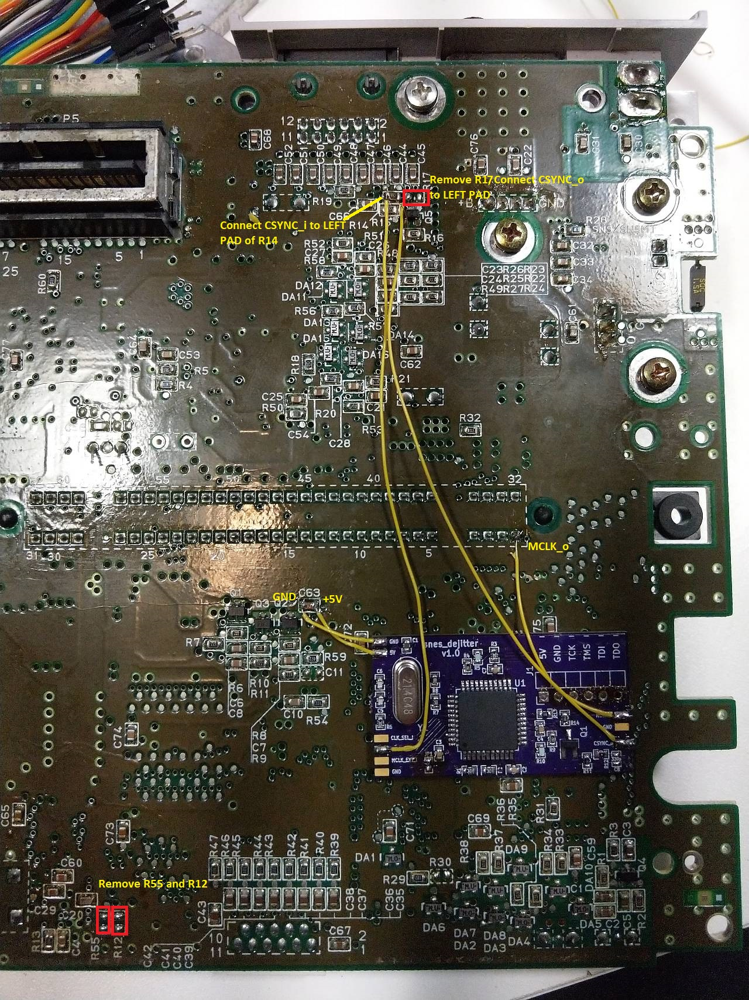

SNS-CPU-APU-01 installation guide
==============

Features

* single MCLK provided by snes_dejitter
* de-jittered CSYNC on multi-AV pin 3 (compatible with RGB cables wired to use CSYNC)

Steps

1. Remove R12, R17 and R55 from SNES mainboard
2. Leave C8 unpopulated on snes_dejitter board (on v1.2 revision leave JP3 open)
3. Short JP2 on snes_dejitter board (v1.2 revision only)
4. Cover copper areas on the bottom of snes_dejitter with electrical tape
5. Attach snes_dejitter on the bottom of SNES mainboard via double-sided adhesive tape
6. Connect 5V, GND, CSYNC_i, CSYNC_o and MCLK_o as shown in image below

